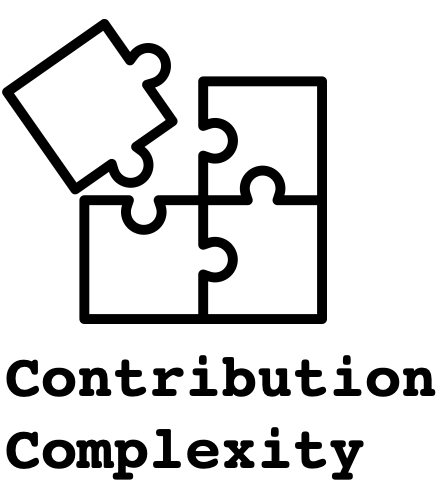

# Contribution Complexity

## What is this?

This CLI tool computes the complexity of a specified contribution to a git repository.
A contribution is one or more commits specified by their commit hashes.
Alternatively, if commit messages contain references to issue numbers, a contribution can be specified by a regular expression matching a certain set of commits.

The tool reports a contribution complexity on the scale `low`, `moderate`, `medium`, `elevated`, `high`.
That value identifies weather a contribution was simple to make (value `low`) or if it consists of multiple intricate changes (value `high`).

For example, the storage engine of [Apache Cassandra](https://cassandra.apache.org/) (DBMS) was refactored for version 3 to better support certain concepts of the query language and to allow for future performance optimizations, see [ticket `CASSANDRA-8099`](https://issues.apache.org/jira/browse/CASSANDRA-8099)
The [corresponding commit](https://github.com/apache/cassandra/commit/a991b64811f4d6adb6c7b31c0df52288eb06cf19) modifies almost 50k lines in 645 files and contains many non-trivial changes.
On the other hand a [bug](https://issues.apache.org/jira/browse/CASSANDRA-12886) that prevented under certain circumstances streaming between cluster nodes was fixed with a [quite tiny patch](https://github.com/apache/cassandra/commit/06feaefba50301734c490521d720c8a482f638e4) modifying 15 lines in two files.

For humans inspecting the two contributions it is quickly clear that the former contribution is way more complex to implement than the latter.

This tool is meant to automate the process of identification of contributions of various complexities either for inclusion in a CI setup or for research. 


## Why does it exist?


## How does it work?

To determine complexity of a contribution it is not enough to solely check the size of it, e.g., via the number of modified files or the number of modified lines.

For example, the [highly complex refactoring of Apache Cassandra's storage engine](https://github.com/apache/cassandra/commit/a991b64811f4d6adb6c7b31c0df52288eb06cf19) modifies 645 files.
The work on [issue #2228](https://github.com/gchq/Gaffer/issues/2228) of the Gaffer graph DB [modifies with 1975 more than three times as many files](https://github.com/gchq/Gaffer/commit/3de5b326c3edd22730000d6585c2fe8b039dabba).
However, that contribution is -even though quite large- really simple.
It just updates a year number in all copyright headers.


## Running 


```bash
$ pip install contribution-complexity
```

```bash
$ contribcompl commits <path_to_repo> <commit_shas>...

```

```
$ git clone git@github.com:apache/Cassandra.git /tmp/cassandra
$ contribcompl commits /tmp/cassandra 021df085074b761f2b3539355ecfc4c237a54a76 2f1d6c7254342af98c2919bd74d37b9944c41a6b
ContributionComplexity.LOW
```

### Attribution

The logo is adapted from a [flaticon icon](on https://www.flaticon.com/free-icon/puzzle_808497?term=contribution&page=1&position=16&page=1&position=16&related_id=808497&origin=search). Proper attribution to the original:
<div>Icons made by <a href="https://www.flaticon.com/authors/mynamepong" title="mynamepong">mynamepong</a> from <a href="https://www.flaticon.com/" title="Flaticon">www.flaticon.com</a></div>